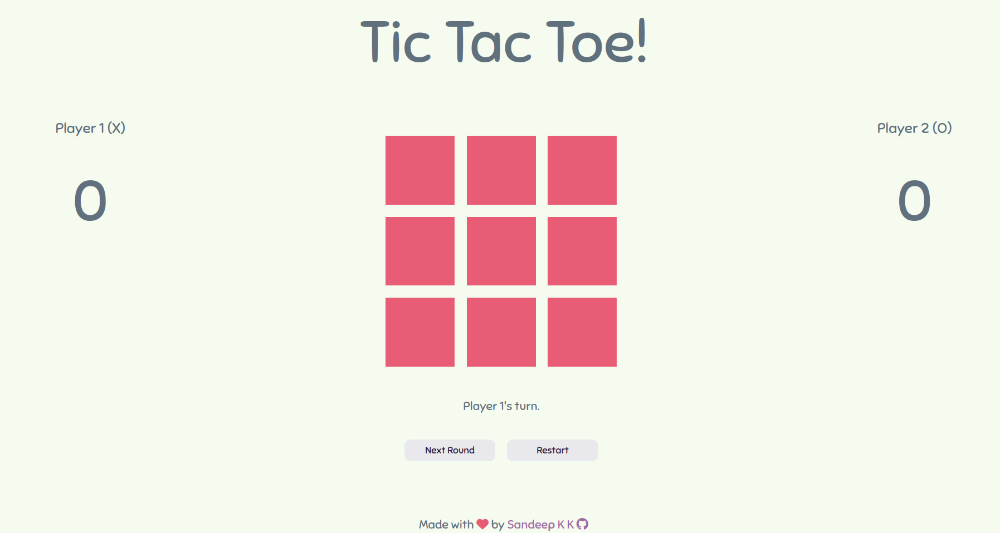

# Tic Tac Toe

Project from The Odin Project [Curriculum](https://www.theodinproject.com/lessons/node-path-javascript-tic-tac-toe)

## **What I Learned**:

By doing this project, I learned

- Using Factory Functions & Module Pattern to organise JavaScript through encapsulation
- Using factory functions instead of object constructors to create objects
- Scopes and closures
- Using closures in Module Pattern to create private scope
- Using ESLint & Prettier to enforce coding style (not 100% since there's a lot of coupling due to modules calling each other's methods)
- CSS animation property

## **Live Preview**:

[Click Here](https://sandeepdotcode.github.io/tic-tac-toe/)

## **Preview**:

## **Features to be added**:

- AI difficulty settings using minimax algorithm
- refactoring (the code is lot more messier than I like)